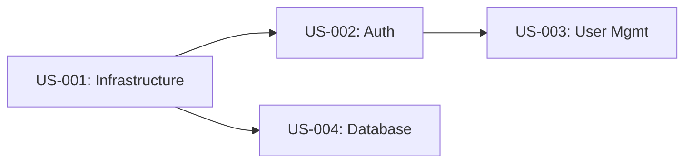

# Sprint Plan Template

**Sprint ID:** SPRINT-XXX  
**Created by:** Tech Lead Agent  
**Date:** [Date]  
**Project:** [Project Name]  
**Sprint Duration:** [X weeks]  
**Sprint Dates:** [Start Date] - [End Date]

---

## Sprint Goal

[1-2 sentence statement of what this sprint aims to achieve. Should be specific, measurable, and valuable to stakeholders.]

---

## Sprint Objectives

### Primary Objectives

1. **[Objective 1]**
   - Success metric: [How we measure success]
   - Value: [Business value delivered]

2. **[Objective 2]**
   - Success metric: [How we measure success]
   - Value: [Business value delivered]

### Secondary Objectives (Nice to Have)

1. **[Objective 3]**
   - If capacity allows

---

## Team Capacity

### Team Composition

| Role | Name/Agent | Availability | Capacity (hours) |
|------|------------|--------------|------------------|
| Tech Lead | [Name] | [%] | [hours] |
| Coding Agent(s) | [Name] | [%] | [hours] |
| Code Inspector | [Name] | [%] | [hours] |
| Security Agent | [Name] | [%] | [hours] |
| QA Lead | [Name] | [%] | [hours] |
| **Total** | | | **[hours]** |

### Capacity Notes

- **Holidays/PTO:** [List any planned time off]
- **Capacity Reduction:** [Meetings, support work, etc.]
- **Net Capacity:** [Total hours available for development]

---

## Sprint Backlog

### Stories Committed

#### US-XXX: [Story Title] - Priority: HIGH

**Story Points:** [X]  
**Assigned to:** [Coding Agent]  
**Dependencies:** [None / US-XXX]  
**Skills Required:**
- [skill-name]

**Acceptance Criteria:**
- [ ] [Criteria 1]
- [ ] [Criteria 2]

**Readiness Checklist:**
- [✅] Story is clear and detailed
- [✅] Acceptance criteria defined
- [✅] Dependencies identified
- [✅] Technical approach agreed
- [✅] No blockers

**Estimated Timeline:** [X days]

---

#### US-XXX: [Story Title] - Priority: MEDIUM

[Repeat structure for each story]

---

### Sprint Backlog Summary

| Story ID | Title | Priority | Points | Status | Assigned To |
|----------|-------|----------|--------|--------|-------------|
| US-XXX | [Title] | HIGH | [X] | Not Started | [Agent] |
| US-XXX | [Title] | HIGH | [X] | Not Started | [Agent] |
| US-XXX | [Title] | MED | [X] | Not Started | [Agent] |
| **Total** | **[N] stories** | | **[X] points** | |

---

## Dependencies

### Internal Dependencies

**Dependency Matrix:**

| Story | Depends On | Blocks |
|-------|------------|--------|
| US-002 | US-001 | US-003, US-005 |
| US-003 | US-002 | US-006 |
| US-004 | US-001 | US-007 |

**Critical Path:** US-001 → US-002 → US-003

---

### External Dependencies

| Dependency | Owner | Status | Due Date | Risk |
|------------|-------|--------|----------|------|
| [Azure setup] | [Team/Person] | In Progress | [Date] | LOW |
| [API access] | [Team/Person] | Blocked | [Date] | HIGH |

---

## Risk Assessment

### Identified Risks

#### Risk #1: [Risk Title]

**Probability:** High / Medium / Low  
**Impact:** High / Medium / Low  
**Risk Level:** CRITICAL / HIGH / MEDIUM / LOW

**Description:**
[What could go wrong]

**Mitigation Strategy:**
[How we reduce the risk]

**Contingency Plan:**
[What we do if it happens]

**Owner:** [Who monitors this]

---

#### Risk #2: [Risk Title]

[Repeat structure for each risk]

---

## Quality Gates

### Code Review

**Process:**
1. Coding Agent implements story
2. Code Inspector reviews (iteration #1)
3. If issues: Return to Coding Agent (track iteration count)
4. If pass: Proceed to Security Agent

**Maximum Iterations:** 5 (combined Code Inspector + Security Agent)  
**Escalation:** If > 5 iterations, escalate to user

---

### Security Review

**Process:**
1. Security Agent performs automated scan (Semgrep)
2. Security Agent performs manual review
3. If FAIL: Return to Coding Agent with findings
4. If PASS: Story complete

**Blocking Issues:**
- ERROR severity findings from Semgrep
- Critical security vulnerabilities
- GDPR violations
- Exposed secrets

---

### Sprint End QA

**Process:**
1. QA Lead validates full sprint
2. Integration testing
3. UI testing with Playwright
4. Performance testing
5. Final acceptance testing

**Definition of Done (Sprint):**
- [ ] All committed stories complete
- [ ] All tests passing
- [ ] Security reviews passed
- [ ] Documentation updated
- [ ] Deployed to staging
- [ ] Stakeholder demo complete

---

## Technical Notes

### Technology Stack (Sprint-Specific)

- **Backend:** [Django, etc.]
- **Frontend:** [If applicable]
- **Database:** [PostgreSQL via Supabase]
- **Infrastructure:** [Azure]
- **Tools:** [Semgrep, Playwright, etc.]

### MCP Servers Available

- [✅] Django MCP (framework patterns)
- [✅] Azure MCP (deployment)
- [✅] Semgrep MCP (security)
- [✅] GitHub MCP (tracking)
- [✅] Playwright MCP (UI testing)
- [✅] n8n MCP (workflows)

### Skills in Use

- `skills/secure-coding-skill.md` (all agents)
- `skills/sprint-planning-skill.md` (Tech Lead)
- `skills/code-review-checklist-skill.md` (Code Inspector)
- `skills/test-case-design-skill.md` (QA Lead)

---

## Sprint Schedule

### Week 1: [Dates]

**Monday:**
- Sprint planning meeting
- Story assignments
- Environment verification

**Tuesday-Friday:**
- US-001 implementation (Priority)
- US-002 starts (if US-001 ready)

**Milestones:**
- [ ] US-001 code complete
- [ ] US-001 security review passed

---

### Week 2: [Dates]

**Monday-Thursday:**
- US-002 implementation
- US-003 implementation
- US-004 starts

**Friday:**
- Sprint review preparation
- QA validation starts

**Milestones:**
- [ ] All stories code complete
- [ ] All security reviews passed

---

### Sprint End: [Date]

**Activities:**
- Final QA testing
- Sprint review/demo
- Sprint retrospective
- Sprint closure

---

## Communication Plan

### Daily Sync

**When:** [Time]  
**Duration:** 15 minutes  
**Attendees:** All agents/team  
**Format:**
- What did you complete yesterday?
- What are you working on today?
- Any blockers?

### Mid-Sprint Check-in

**When:** [Date/Time]  
**Purpose:** Review progress, adjust plan if needed

### Sprint Review

**When:** [Date/Time]  
**Attendees:** Team + stakeholders  
**Agenda:**
- Demo completed stories
- Review sprint goal achievement
- Stakeholder feedback

### Sprint Retrospective

**When:** [After sprint review]  
**Attendees:** Team only  
**Topics:**
- What went well?
- What could improve?
- Action items

---

## Success Metrics

### Sprint Completion

- **Planned:** [X] story points
- **Stretch Goal:** [Y] story points
- **Target Velocity:** [Z] points per sprint

### Quality Metrics

- **Code Review:** First-time pass rate > 70%
- **Security:** Zero critical issues in production
- **Testing:** Code coverage > 80%
- **Bugs:** < [X] bugs found in QA

### Velocity Tracking

| Sprint | Planned | Completed | Velocity |
|--------|---------|-----------|----------|
| Previous | [X] | [Y] | [Y] |
| Current | [X] | [TBD] | [TBD] |

---

## Definition of Ready (Stories)

Before a story enters the sprint:

- [ ] User story format complete (As a/I want/So that)
- [ ] Acceptance criteria clearly defined
- [ ] Dependencies identified and resolved/tracked
- [ ] Story sized and estimated
- [ ] Technical approach agreed upon
- [ ] No open questions or blockers
- [ ] Skills and MCPs identified

---

## Definition of Done (Stories)

Before a story is marked complete:

- [ ] Code implemented per acceptance criteria
- [ ] Unit tests written and passing (>80% coverage)
- [ ] Code review passed (Code Inspector)
- [ ] Security review passed (Security Agent)
- [ ] Integration tests passing
- [ ] Documentation updated
- [ ] Deployed to staging environment
- [ ] Demo-ready

---

## Sprint Burndown

### Planned Burndown

| Day | Remaining Points |
|-----|------------------|
| Day 0 | [Total] |
| Day 1 | [Points] |
| Day 2 | [Points] |
| ... | ... |
| Last Day | 0 |

### Actual Progress (Updated Daily)

| Day | Date | Completed | Remaining | Notes |
|-----|------|-----------|-----------|-------|
| 0 | [Date] | 0 | [Total] | Sprint start |
| 1 | [Date] | [X] | [Y] | [Notes] |

---

## Contingency Plans

### If Behind Schedule

**Triggers:**
- > 20% variance from burndown by mid-sprint
- Blocker lasting > 2 days
- Dependency not met

**Actions:**
1. Review scope: Can any stories be deferred?
2. Add capacity: Can other agents help?
3. Simplify: Can we reduce scope of stories?
4. Escalate: Inform stakeholders of revised commitment

### If Ahead of Schedule

**Actions:**
1. Pull next priority story from backlog
2. Technical debt reduction
3. Documentation improvements
4. Automation enhancements

---

## Sprint Backlog Adjustments

### Changes During Sprint

| Date | Change | Reason | Impact |
|------|--------|--------|--------|
| [Date] | Added US-XXX | [Reason] | +[X] points |
| [Date] | Removed US-XXX | [Reason] | -[X] points |

**Current Commitment:** [Updated total]

---

## Notes & Decisions

### Key Decisions

| Date | Decision | Rationale | Impact |
|------|----------|-----------|--------|
| [Date] | [Decision] | [Why] | [Effect on sprint] |

### Open Items

- [ ] [Item 1] - Owner: [Name] - Due: [Date]
- [ ] [Item 2] - Owner: [Name] - Due: [Date]

---

## Retrospective (Post-Sprint)

### What Went Well ✅

1. [Success 1]
2. [Success 2]
3. [Success 3]

### What Could Improve ⚠️

1. [Issue 1]
2. [Issue 2]
3. [Issue 3]

### Action Items 📋

1. **[Action 1]** - Owner: [Name] - Due: [Date]
2. **[Action 2]** - Owner: [Name] - Due: [Date]

---

## Sprint Completion Summary

**Sprint Goal Achievement:** ✅ Achieved / ⚠️ Partially / ❌ Not Achieved

**Metrics:**
- **Planned Points:** [X]
- **Completed Points:** [Y]
- **Completion Rate:** [Y/X%]
- **Stories Completed:** [N] of [M]
- **Quality:** [Issues found in QA]

**Carried Over to Next Sprint:**
- [List incomplete stories]

---

## Sign-off

**Tech Lead:** [Name]  
**Date:** [Date]  
**Status:** [PLANNING / IN PROGRESS / COMPLETED]
