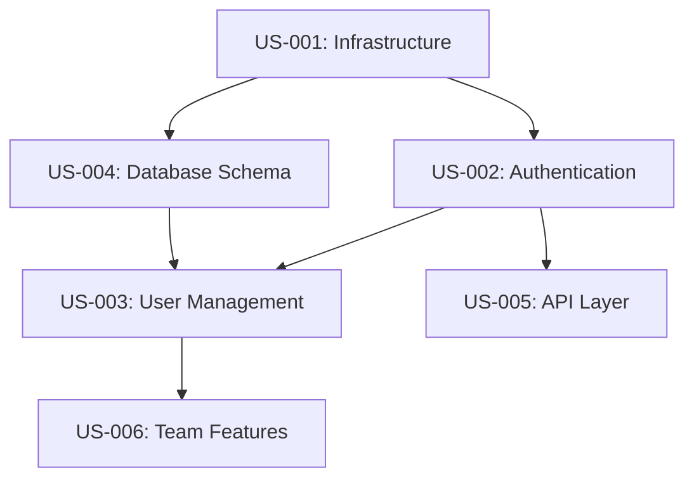

# Task Breakdown Template

**Task Breakdown ID:** TB-XXX  
**Created by:** Task Manager Agent  
**Date:** [Date]  
**Project:** [Project Name]  
**Epic/Feature:** [Epic ID or Feature Name]  
**Sprint:** [Sprint ID if assigned]

---

## Epic/Feature Overview

**Epic ID:** EPIC-XXX  
**Epic Title:** [High-level feature or initiative]

**Epic Goal:**
[What this epic aims to achieve - business value and user benefit]

**Epic Owner:** [Stakeholder/Product Owner]

**Target Release:** [Release version/date]

---

## Scope Definition

### In Scope

**What is included:**
1. [Capability 1]
2. [Capability 2]
3. [Capability 3]

**Deliverables:**
- [Deliverable 1]
- [Deliverable 2]

### Out of Scope

**What is explicitly NOT included:**
1. [Item 1 excluded]
2. [Item 2 excluded]

**Rationale:**
[Why these items are out of scope]

---

## User Stories Breakdown

### Story Hierarchy

```
EPIC-XXX: [Epic Title]
│
├── US-001: [Story 1 Title] (Must Have)
│   ├── Task 1.1
│   ├── Task 1.2
│   └── Task 1.3
│
├── US-002: [Story 2 Title] (Must Have)
│   ├── Task 2.1
│   └── Task 2.2
│
├── US-003: [Story 3 Title] (Should Have)
│   ├── Task 3.1
│   ├── Task 3.2
│   └── Task 3.3
│
└── US-004: [Story 4 Title] (Nice to Have)
    └── Task 4.1
```

---

## User Story #1: [Title]

**Story ID:** US-001  
**Priority:** Must Have / Should Have / Could Have / Won't Have  
**Story Points:** [X]  
**Dependencies:** [None / US-XXX]

### Story Description

**As a** [user role]  
**I want** [goal/desire]  
**So that** [benefit/value]

### Acceptance Criteria

- [ ] Given [context], when [action], then [expected result]
- [ ] Given [context], when [action], then [expected result]
- [ ] Given [context], when [action], then [expected result]

### Task Breakdown

#### Task 1.1: [Task Title]

**Type:** Development / Design / Research / Testing / Documentation  
**Assigned to:** [Agent/Team member]  
**Estimated Effort:** [Hours/Days]  
**Dependencies:** [None / Task X.Y]

**Description:**
[Detailed description of what needs to be done]

**Technical Details:**
- [Implementation notes]
- [Technology choices]
- [Integration points]

**Acceptance Criteria:**
- [ ] [Specific completion criteria]

**Skills Needed:**
- [skill-name.md]

**MCP Tools:**
- [MCP server needed]

---

#### Task 1.2: [Task Title]

[Repeat structure for each task]

---

## User Story #2: [Title]

[Repeat structure for each user story]

---

## Story Summary Matrix

| Story ID | Title | Priority | Points | Est. Hours | Sprint | Status | Dependencies |
|----------|-------|----------|--------|------------|--------|--------|--------------|
| US-001 | [Title] | Must Have | 8 | 40 | SPRINT-01 | Not Started | - |
| US-002 | [Title] | Must Have | 5 | 25 | SPRINT-01 | Not Started | US-001 |
| US-003 | [Title] | Should Have | 5 | 25 | SPRINT-02 | Not Started | US-001 |
| US-004 | [Title] | Could Have | 3 | 15 | Backlog | Not Started | US-002 |
| **Total** | **4 stories** | | **21** | **105** | | |

---

## Dependency Mapping

### Dependency Graph



### Dependency Details

| Story | Type | Depends On | Blocks | Critical Path |
|-------|------|------------|--------|---------------|
| US-001 | Infrastructure | - | US-002, US-004 | ✅ YES |
| US-002 | Feature | US-001 | US-003, US-005 | ✅ YES |
| US-003 | Feature | US-002, US-004 | US-006 | ✅ YES |
| US-004 | Feature | US-001 | US-003 | ⚠️ Partial |
| US-005 | Feature | US-002 | - | ❌ NO |

**Critical Path:** US-001 → US-002 → US-003 → US-006

**Bottleneck Stories:** [Stories that block many others]

---

## Sprint Allocation

### Sprint 1: [Sprint Goal]

**Sprint Dates:** [Start] - [End]  
**Sprint Goal:** [1-sentence sprint objective]

**Stories Included:**

| Story ID | Title | Points | Assigned To | Status |
|----------|-------|--------|-------------|--------|
| US-001 | [Title] | 8 | [Agent] | Not Started |
| US-002 | [Title] | 5 | [Agent] | Not Started |
| **Total** | **2 stories** | **13** | | |

**Sprint Velocity Target:** [Points]  
**Sprint Risk:** Low / Medium / High

---

### Sprint 2: [Sprint Goal]

[Repeat structure]

---

### Backlog (Not Yet Scheduled)

| Story ID | Title | Points | Priority | Reason Not Scheduled |
|----------|-------|--------|----------|---------------------|
| US-007 | [Title] | 3 | Could Have | Lower priority |
| US-008 | [Title] | 5 | Won't Have | Out of scope for v1 |

---

## Effort Estimation

### Story Point Distribution

| Story Points | Number of Stories | Total Points |
|--------------|-------------------|--------------|
| 1-2 (Small) | [#] | [X] |
| 3-5 (Medium) | [#] | [X] |
| 8-13 (Large) | [#] | [X] |
| 20+ (Too Large) | [#] | [X] |
| **Total** | **[#]** | **[X]** |

### Time Estimation

**Total estimated effort:** [Hours/Days]

**Breakdown by activity:**
- Development: [Hours] ([%])
- Testing: [Hours] ([%])
- Code Review: [Hours] ([%])
- Security Review: [Hours] ([%])
- Documentation: [Hours] ([%])
- Deployment: [Hours] ([%])

**With 20% buffer:** [Total hours]

---

## Resource Allocation

###Team Capacity

| Role | Agent/Name | Availability | Capacity (hrs/sprint) |
|------|------------|--------------|----------------------|
| Tech Lead | [Name] | 80% | [hrs] |
| Coding Agent(s) | [Names] | 100% | [hrs] |
| Code Inspector | [Name] | 50% | [hrs] |
| Security Agent | [Name] | 30% | [hrs] |
| QA Lead | [Name] | 60% | [hrs] |
| **Total** | | | **[hrs]** |

### Story Assignment

| Story ID | Primary Owner | Supporting Roles | Status |
|----------|---------------|------------------|--------|
| US-001 | Coding Agent 1 | Tech Lead | Not Started |
| US-002 | Coding Agent 2 | Security Agent | Not Started |

---

## Technical Architecture Overview

### Technology Stack

**Frontend:**
- [Framework/Library]
- [Key technologies]

**Backend:**
- Django
- Django REST Framework
- Python 3.11

**Database:**
- PostgreSQL via Supabase
- RLS (Row Level Security)

**Infrastructure:**
- Azure App Service (Sweden Central)
- Azure Key Vault
- Application Insights

**Authentication:**
- Supabase Auth
- JWT tokens

**Testing:**
- pytest (backend)
- Playwright (UI)
- Semgrep (security)

---

### System Components

```
┌────────────────────────────────────────────┐
│              Frontend                       │
│  [Technology]                               │
└──────────────┬─────────────────────────────┘
               │ REST API
               ▼
┌────────────────────────────────────────────┐
│           Django Backend                    │
│  ├── Models (Data layer)                   │
│  ├── Views/Serializers (API layer)         │
│  ├── Authentication (Supabase Auth)        │
│  └── Business Logic                        │
└──────────────┬─────────────────────────────┘
               │
               ▼
┌────────────────────────────────────────────┐
│      PostgreSQL (via Supabase)             │
│  ├── Tables                                │
│  ├── RLS Policies                          │
│  ├── Functions                             │
│  └── Triggers                              │
└────────────────────────────────────────────┘
```

---

## Skills & MCP Requirements

### Skills Mapping

| Story | Required Skills |
|-------|-----------------|
| US-001 | azure-deployment, infrastructure-setup |
| US-002 | authentication-authorization-skill.md, secure-coding-skill.md |
| US-003 | database-design-skill.md, django-patterns |
| US-004 | api-design-skill.md, rest-conventions |

### MCP Tools Needed

| Story | MCP Servers |
|-------|-------------|
| US-001 | Azure MCP, Django MCP |
| US-002 | Django MCP, Semgrep MCP |
| US-003 | Django MCP, PostgreSQL MCP |
| US-004 | Django MCP, OpenAPI MCP |

---

## Risk Assessment

### Identified Risks

#### Risk #1: [Risk Title]

**Category:** Technical / Resource / Schedule / Dependency  
**Probability:** High / Medium / Low  
**Impact:** High / Medium / Low  
**Risk Score:** [Probability × Impact]

**Description:**
[What could go wrong]

**Impact if occurs:**
[Consequences]

**Mitigation Strategy:**
[How to reduce probability]

**Contingency Plan:**
[What to do if it happens]

**Owner:** [Who monitors this]

---

#### Risk #2: [Risk Title]

[Repeat structure]

---

### Risk Matrix

| Risk | Probability | Impact | Score | Mitigation Owner | Status |
|------|-------------|--------|-------|------------------|--------|
| [Risk 1] | High | High | 9 | [Owner] | Mitigating |
| [Risk 2] | Med | High | 6 | [Owner] | Monitoring |
| [Risk 3] | Low | Med | 2 | [Owner] | Accepted |

---

## Quality Standards

### Definition of Ready (Story Level)

Before a story enters a sprint:

- [ ] Story format complete (As a/I want/So that)
- [ ] Acceptance criteria clearly defined
- [ ] Dependencies identified
- [ ] Story sized (<13 points) and estimated
- [ ] Technical approach agreed
- [ ] Design mockups available (if UI work)
- [ ] Test scenarios identified
- [ ] No blockers

### Definition of Done (Story Level)

Before a story is marked complete:

- [ ] Code complete per acceptance criteria
- [ ] Unit tests written and passing (>80% coverage)
- [ ] Code review passed
- [ ] Security review passed
- [ ] Integration tests passing
- [ ] Documentation updated
- [ ] Deployed to staging
- [ ] Demo-ready

---

## Testing Strategy

### Test Coverage Requirements

**Unit Tests:**
- Backend models: 90%+ coverage
- Backend views: 85%+ coverage
- Business logic: 95%+ coverage

**Integration Tests:**
- API endpoints: 90%+ coverage
- Authentication flows: 100%
- Critical user journeys: 100%

**UI Tests:**
- Happy paths: 100%
- Error handling: 90%
- Accessibility: 100%

**Security Tests:**
- Automated Semgrep scans: All stories
- Manual security review: Critical stories

---

## Implementation Phases

### Phase 1: Foundation (Sprint 1)

**Goal:** Establish infrastructure and core systems

**Stories:**
- US-001: Infrastructure Setup
- US-002: Database Schema
- US-003: Authentication

**Deliverables:**
- Working infrastructure
- Database with RLS
- User authentication

---

### Phase 2: Core Features (Sprint 2-3)

**Goal:** Build primary functionality

**Stories:**
- US-004: User Management
- US-005: Team Management
- US-006: Content Pages

**Deliverables:**
- User and team CRUD
- Content management system

---

### Phase 3: Advanced Features (Sprint 4-5)

**Goal:** Add sophisticated capabilities

**Stories:**
- US-007: Task Management
- US-008: Document Management
- US-009: Notifications

**Deliverables:**
- Complete task system
- Document upload/storage
- Notification system

---

### Phase 4: Polish & Launch (Sprint 6)

**Goal:** Final QA and deployment

**Activities:**
- Full regression testing
- Performance optimization
- Security hardening
- Production deployment

---

## Success Metrics

### KPIs for Epic Completion

**Development Metrics:**
- [ ] All Must Have stories completed
- [ ] 90%+ Should Have stories completed
- [ ] 80%+ test coverage achieved
- [ ] Zero critical security issues
- [ ] Performance benchmarks met

**Business Metrics:**
- [ ] [Business KPI 1]
- [ ] [Business KPI 2]

**Quality Metrics:**
- [ ] < 5 bugs per story in production
- [ ] 95%+ uptime
- [ ] < 2s page load time

---

## Communication Plan

### Stakeholder Updates

**Frequency:** [Weekly / Bi-weekly]  
**Format:** [Status report / Demo]

**Update includes:**
- Stories completed
- Stories in progress
- Blockers and risks
- Upcoming milestones

### Team Sync

**Daily Standups:** [Time]  
**Sprint Planning:** [When]  
**Sprint Review:** [When]  
**Sprint Retro:** [When]

---

## Assumptions & Constraints

### Assumptions

1. [Assumption 1]
2. [Assumption 2]
3. [Assumption 3]

### Constraints

**Technical Constraints:**
- [Constraint 1]
- [Constraint 2]

**Resource Constraints:**
- [Team size, budget, timeline]

**Business Constraints:**
- [Compliance, regulations, policies]

---

## Open Questions

| # | Question | Owner | Status | Due Date |
|---|----------|-------|--------|----------|
| 1 | [Question 1] | [Owner] | Open | [Date] |
| 2 | [Question 2] | [Owner] | Answered | [Date] |

---

## Backlog Grooming Notes

### Next Grooming Session

**Date:** [Date]  
**Agenda:**
- Review completed stories
- Refine upcoming stories
- Re-estimate if needed
- Reprioritize based on feedback

---

## Appendices

### Appendix A: Story Templates

[Link to user-story-template.md]

### Appendix B: Technical Specifications

[Link to detailed technical docs]

### Appendix C: Design Assets

[Link to wireframes, mockups, design system]

---

## Version History

| Version | Date | Changes | Author |
|---------|------|---------|--------|
| 1.0 | [Date] | Initial breakdown | Task Manager |
| 1.1 | [Date] | Added stories 5-6 | Task Manager |
| 2.0 | [Date] | Major revision after review | Task Manager |

---

## Approval & Sign-off

**Task Breakdown Approved By:**

- [ ] Product Owner: [Name] - [Date]
- [ ] Tech Lead: [Name] - [Date]
- [ ] Team: [Names] - [Date]

**Ready for Sprint Planning:** YES / NO

---

## Notes

[Any additional context, decisions, or important information]

---

**Task Manager:** [Agent name]  
**Date Created:** [Date]  
**Last Updated:** [Date]  
**Status:** [DRAFT / IN REVIEW / APPROVED / IN PROGRESS]
